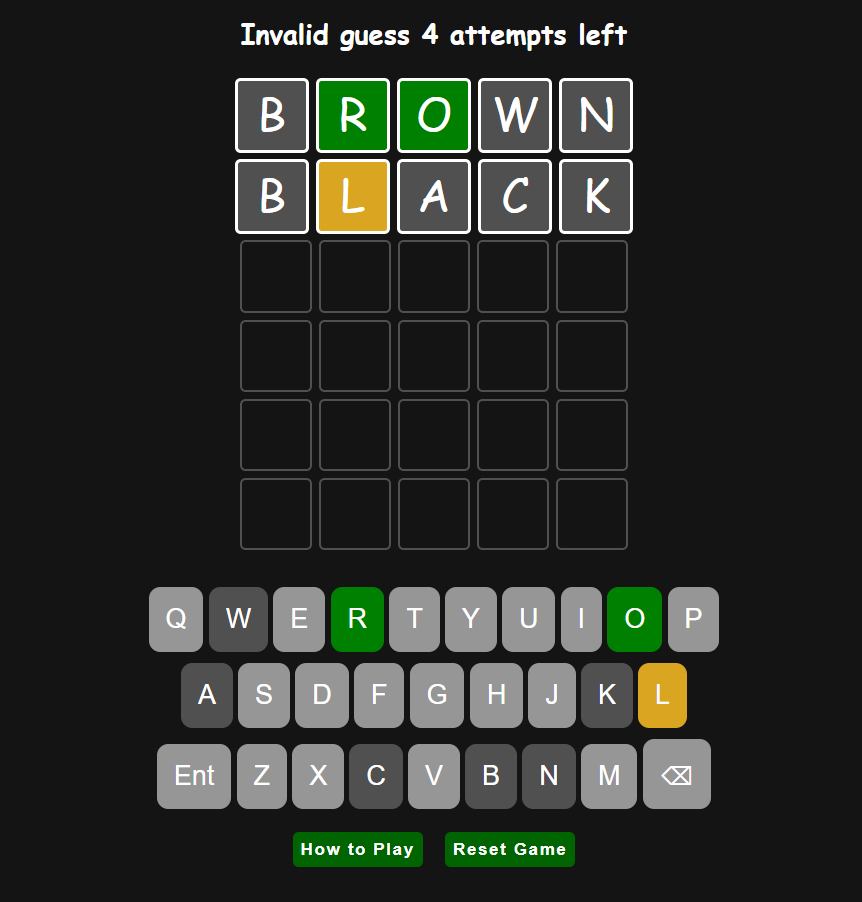

# Wordle Game

_A game that tests your memory, patience, and critical thinking with sound effects._



## Getting Started

### Play the Game
[Deployed Game](https://hussain-almutawa7.github.io/wordle-game/)

### How to Play
1. Press the play button after reading the instructions.
2. Guess the 5-letter word in 6 attempts.
3. Press the reset button if you want to play with a different word.
4. Press "How to Play" to go back to the instructions.

### Installation
No installation is required. Simply clone the repo to your machine and open the `index.html` file in your browser.

```bash
git clone https://github.com/Hussain-Almutawa7/wordle-game.git
cd wordle-game
open index.html
```

### Technologies Used
- **HTML**
- **CSS**
- **JavaScript**

### Future Enhancements
- Add difficulty levels.
- Add a score system.
- Improve mobile responsiveness.

### Credits
- Inspired by the original Wordle game.